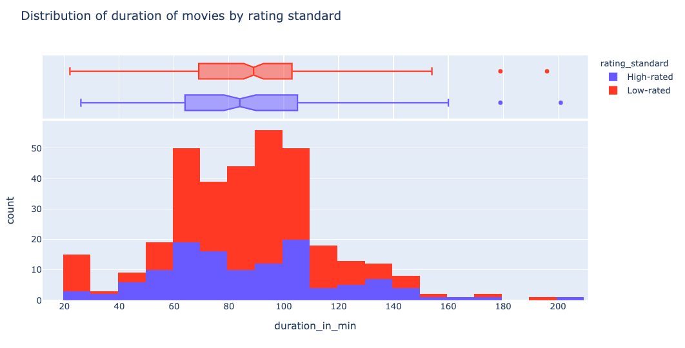
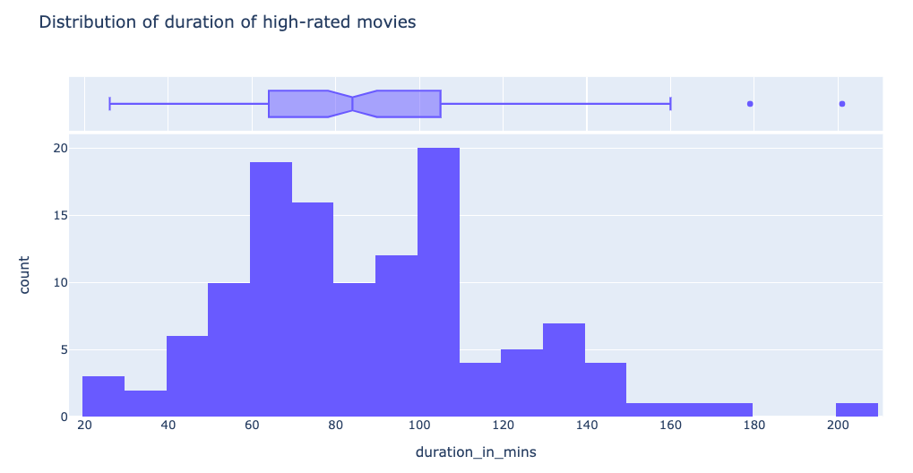
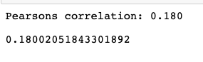
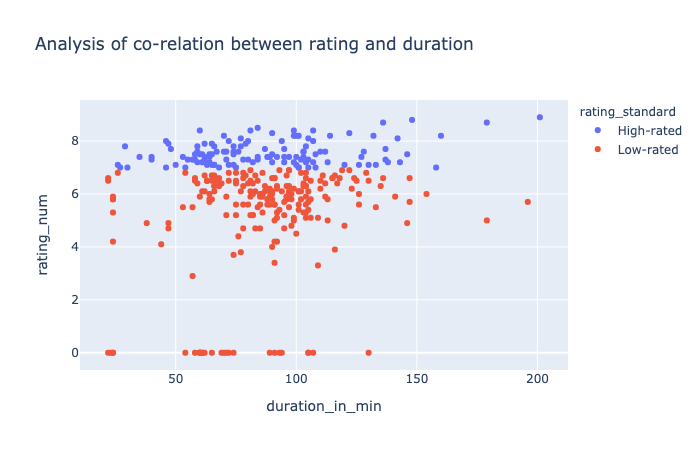

## Duration and rating analysis

For full version of code, click [here](Individual Project 03-Copy1.ipynb)


#### Generally, how long are the movies in Netflix? How long are good rated movies? How long should the good rated movie be?


After general analysis of content of netflix, it is considerable to think if duration of the movie are some how affecting the rating.


Thus, I plotted the distribution of duration of movie.
```
#plotting the histogram of distribution of movies with both high-standard and low-standard to analyze their distribution pattern
fig = px.histogram(movie_analysis_edited, x="duration_in_min", color="rating_standard", 
                   nbins=18,title='Distribution of duration of movies by rating standard', marginal="box") # can be `box`, `violin`)
                   
fig.show()
```


This distibution plots both high-rated and low-rated movie. On general, both type of movie have similar kind of pattern. Most of the movie in netflix are ranged from 60 mins to 100 mins. Thus, it is normal to see many movies with duration from 1 hrs to 1 hr and 40 mins. 

Though it is normal to see many movies between these durations, I would like to emphasize on high-rated movies.



High-rated movies do have the similar pattern ranging bewteen 1 hrs to 1 hr and 40 mins. Thus, I would say both the hig-rated and low-ratd movie have similar duration.

Now, after this analysis I was interested to see if there is any relation between duration and rating. Generally, duration of the content seems to have some kind of relation.  If the duration of movie is long, there might be chance that the movie/show rating will decrease.
```
# Apply the pearsonr() 
corr, _ = pearsonr(list1, list2) 
print('Pearsons correlation: %.3f' % corr)

correlation = list1.corr(list2)
correlation
```
Let's see the co-relation



Now let's plot it


However, the plot does not show they have a strong co-relation.

For futher analysis, which includes popular words natural language processing, click [here](Popular words and sentiment.md)
