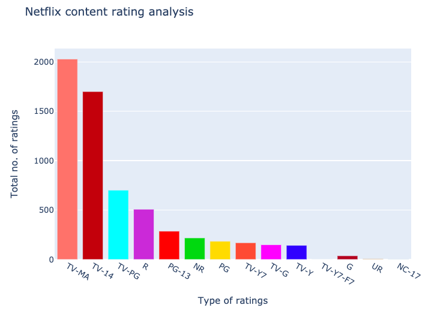

## General analysis (Quality of contents, analysis by country, genre analysis, rating type)

### 1. Quality of contents:
  
   Click [here](try1.html) to view the visualization
  
   This analysis tells how many high-rated movie contents and low-movie contents are there in Netflix and which one is higher.
   
   
   
   

### 2. Analysis by country:
  
  Click [here](try1 copy.html) to view the visualization
  
  This sunbrust analysis shows the quality of content by country which shows that United States have more number of contents with almost more low-rated and less high-rated. Similarly, it follows the same pattern to all country like Japan, Hongkong.However, it is not the same case for United Kingdom. UK has more number of high-rated movies than low-rated movies. So indicating that netflix has to emphasis more in other countries quality content than in UK.
  
 If this is the case, what shall we do to improve quality contents of countries like USA? How would the netflix know which genre contents do they have to focus based on country because pattern might be different by countries. To do that lets dive more into analysis and analyze the genre's by countries.
 
 
 
 
 
### 3. Genre Analysis:

Click [here](try2 copy.html) to view the visualization

The above treemap shows the quality content of genre by country. If we see for the USA, the most popoular genres are Comedies, then comes Dramas, Documentaries, Kids and Teen and so on. This also shows comedies genre are more popular in US. So Netflix to increase the viewers can do couple of things. Either increase the genre contents that netflix have less in numbers like scifi and fantasy, romantic. OR focus on specific genre which have more low rated movies and try to improve the quality of them rather than genre which have abundant high-rated movies. For example there are more no of comedies genre but more of them are low -rated.So rather than emphasizing on drama genre,netflix in US has to focus on comedies, Kids and Teens. While its different in UK. Almost all genres in UK have high-rated movies. Howver, canda follows the US pattern. In canada too, quality of contents of Kids and Teen, Comedy and romantic genres have to be emphasized rather than dramas and documentaries.

**We know that netflix has different rating type shows and movies. So perhaps based on rating types, we can provide some suggestions.**

### 4. Analysis by rating type:

Little Kids: G, TV-Y, TV-G

Older Kids: PG, TV-Y7, TV-Y7-FV, TV-PG

Teens: PG-13, TV-14

Adults:  R, TV-MA, NC-17

G,TV-Y, TV-G -----stands for general audience,

PG,TV-Y7 and Low TV-PG----- Parental Guidance Suggested

PG-13,High TV-PG and Low TV-14------Parents Strongly Cautioned

R, High TV-14, M, Low TV-MA-------- Restricted Under 17 requires accompanying parent or adult guardian

NC-17, High TV-MA- No Children 17 and Under Admitted 

### How does it matter?

By looking at the netflix content we can see that the most popular or the more no of rating type content is TV-MA and then comes TV-14. Netflix has more count of TV-MA, TV-14 , TV-PG and these top three ratung types are mostly adult type movies. However, the netflix seem to not care about the genreal audiences type of contents where there are no any restrictions which includes G, TV-Y, TV-G. Thus to increase its viewers, netflix have to increase its variability in contents. And with people staying home, if as family they would like to watch movies which comes under G, TV-Y category, they donot seem to have abundant option so this might be right time to emphasize on this rating types.

### 5. Analysis by rating type by country

Click [here](try3 copy.html) to view the visualization

Same pattern is seen in this sunburst. Here 'n/a' stands for rating not available. But if we again see by country, TV-MA, TV-14 are the most popular one so it is right time for netflix to have other type of contents to increase its viewers.

Click [here](Duration and rating analysis.md) for further analysis (next page).

