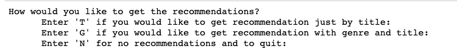
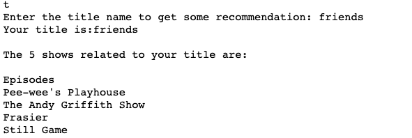
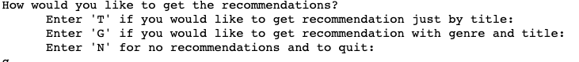
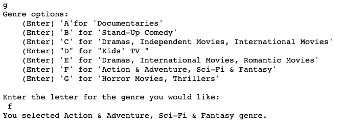
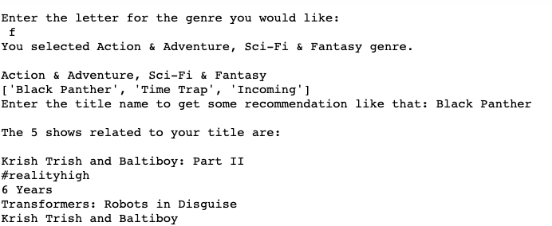
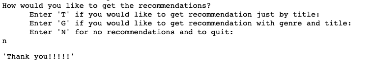
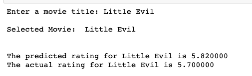
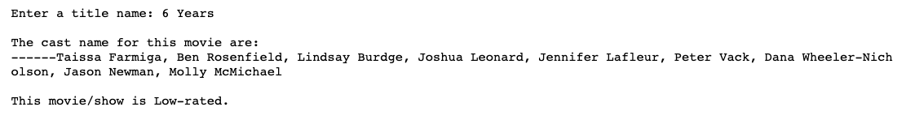
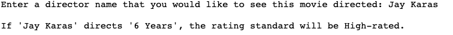

## Recommendation, prediction and classification

### First---the Recommendation
One of the goal of this project was to come up with the recommendation system for Netflix for user so that they could get the choices to watch the movie/show. 
Therefore, I came up with recommendation system where the user will be provided with some menu and options and based on them, they will get the recommendations.
The users will get recommendations based on  title, type, cast, director and genre. For this purpose, I used cosine-similarity and countvectorizer.

The demo is shown below:

### Second-- the Prediction:

Now we want to preidict the rating on based on cast, director, and rating category (TV-MA, TV-14) of the movie/show. This technique is also called the 
supervised machine learning because we actually know what we want to predict. I used cosine-distance and cosine-similarity for this too.

The demo is shown below:

### Then finally,---classifications for rating by director using KNN

After the prediction system, I would like to help Netflix to provide some suggestions on the contents they can choose on basis of director. Thus, this system will
ask the title name from the user. Once the title name is provided, the system will find the cast actors and let us know if the movie is low-rated or high-rated. 
Again, it would ask the user to input the directors name. And based on the directors name and casting it will determine if it will be classified as high-rated or low-rated.

This can help the come up with the pattern for high-rated contents.

The demo is shown below:

With all this analysis, the visualizations are done. **Thank you!!!** for your time. To go to main page,click [here](index.md)

